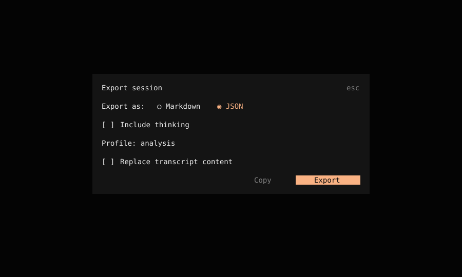
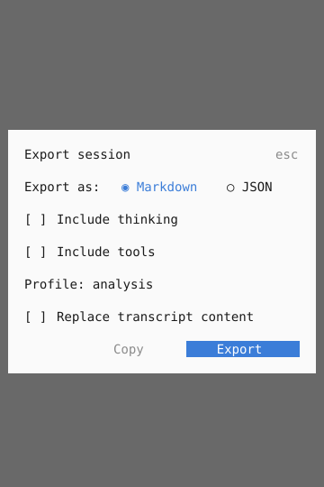

# Harness corrections and verification

The September 2026 harness changes cover nested calls, operator diagnostics, evidence access, offline analysis, scope, technical reporting, isolated assessment and analysis exports. They preserve Session V2 orchestration: one `llm.stream` per physical attempt, existing durable admission and continuation, exclusive task claims and the finding-confirmation gates.

The implementation uses synthetic fixtures and loopback services. The external engagement and the operator's installed configuration are outside these tests. Original evidence remains private; model-visible previews and normal exports redact known credential fields and patterns. Arbitrary unlabeled secret strings still require operator review before publication.

| Work | Implementation                                                                                                                                                              | Verification and remaining runtime work                                                                                                                                                                                                                              |
| ---- | --------------------------------------------------------------------------------------------------------------------------------------------------------------------------- | -------------------------------------------------------------------------------------------------------------------------------------------------------------------------------------------------------------------------------------------------------------------- |
| H01  | Canonical child CallIDs shared by execution, permission and capture; container provenance                                                                                   | Real Location tests cover single, repeated, concurrent, failing and interrupted calls. Interrupted generic calls retain unresolved running records for reconciliation.                                                                                               |
| H02  | `cyber_capabilities`, safe JSONC diagnosis, effective limits and optional read-only Docker inspection; explicit operator setup                                              | Missing, malformed, invalid-schema, disabled and ready profiles have distinct states. Readiness never proves successful launch. Docker runtime checks require an available daemon.                                                                                   |
| H03  | Role/mode/session-permission inventory with direct paths, execute inventory, prohibited operations and environment availability; structured handoffs                        | Restricted-role tests preserve valid results in partial handoffs. A trusted Code Mode registration still enforces each child's policy.                                                                                                                               |
| H04  | Typed configuration, capability, scope, budget, claim, revision, evidence, transport and capture diagnostics with effects and recovery                                      | Scope rejection causes no target traffic. HTTP interruption records unknown effects; task retry rules retain reconciliation requirements. Generic defects remain unknown rather than becoming successes.                                                             |
| H05  | Producer `completion_evidence`, artifact metadata, per-ID rejection reasons and eligible alternatives                                                                       | SQLite tests preserve task revision and state on invalid auxiliary, failed, unrelated-task and cross-engagement references.                                                                                                                                          |
| H06  | Explicit continuation for executions, task detail, tasks, coverage, findings and notes; compact views and filters                                                           | Fixtures pass beyond 25 records and expose the next page; provenance appears only in detail.                                                                                                                                                                         |
| H07  | HTTP body/output references, redirect hops, safe headers, MIME, original hash, resolved and selected address/family                                                         | Real HTTP fixtures preserve scope and rate checks, handle large/empty bodies and redirects, and never repeat transport to retrieve metadata.                                                                                                                         |
| H08  | `cyber_artifacts` analyzes verified original bytes, bounded literal/secret patterns and literal asset references; 16-input batch manifests                                  | Twenty captures, late content beyond the preview, relative/missing/computed imports, byte limits and ownership are tested with zero new HTTP requests. Coverage describes selected inputs and detector limits.                                                       |
| H09  | Explicit `network: none` reduces a scoped Kali profile without network guards or reservations; scoped budgets show units and remaining capacity                             | Offline artifact analysis leaves the network budget unchanged. Container execution and cleanup remain covered by opt-in Docker labs.                                                                                                                                 |
| H10  | URL proposals specify exact scheme/host/TCP port with operator/default provenance                                                                                           | Exact-service, scheme, subdomain, address-family and exclusion tests pass. Existing explicit domain scope remains available. Proposals and recorded operator approval remain separate.                                                                               |
| H11  | Bounded DNS including CAA; distinct negative/error states; TLS chain, hostname, dates and protocol outcomes                                                                 | Local UDP tests cover present/empty/NXDOMAIN/timeout CAA. The production TLS probe passes local trusted wrong-name, untrusted and expired-certificate controls. Container/client-version variants still need the Docker lab.                                         |
| H12  | `cyber_report` derives counts, predecessor/successor history, pending coverage and paginated technical observations                                                         | Eight-task fixture preserves seven completed tasks and one blocked predecessor. A two-port observation remains a two-port observation. Large outputs require detail.                                                                                                 |
| H13  | Local commit/dirty/file hashes remain distinct from deployment identity; bounded offline `cyber_local_validation` compares a candidate with a healthy control               | Real Git tests verify clean/dirty source and changed hashes. The recursion fixture and its container limits are opt-in Docker tests. No original engagement candidate is confirmed by these changes.                                                                 |
| H14  | `cyber_web_plan` persists applicable feature dimensions, evidence and pending/blocked browser requirements                                                                  | The controlled SPA's URL, isolated-storage and CSP controls pass with installed Chrome and driver-pinned Chromium on Windows. CI requires the SPA suite. Rejected preconnections remain blocked; failed actual worker requests retain error evidence.                |
| H15  | Native versus execute catalog; notes use the existing Instructions state and epochs; concise operator policy and selected-module procedures                                 | Unchanged notes produce no additional instruction event or User message. Changes remain chronological and untrusted. Existing fork/compaction instruction tests exercise epoch semantics.                                                                            |
| H16  | Assessment selected before imports; target extensions/instructions remain data; canonical source roots constrain hardened read/glob/grep                                    | Startup, mode inheritance, external files and escaping symlinks are tested. Development preserves normal coding access.                                                                                                                                              |
| H17  | Redacted/private/sanitized/analysis profiles shared by CLI, JSON, Markdown and clipboard; descendant traces, request snapshots, activity, available usage and partial state | Parent/two-child/active-work tests redact errors, files and opaque state. Physical-attempt tests preserve chosen settings and distinguish missing usage from zero. TUI tests render the production dialog at 40/100 columns with light/dark themes.                  |
| H18  | Deterministic regression suite plus an opt-in repeated baseline/candidate model matrix with independent evidence/traffic scoring                                            | The first sixteen-case matrix and narrative review are recorded in [fork-cyber-evaluation.md](fork-cyber-evaluation.md). DeepSeek passes 7/8; MiniMax 0/8. Scope and exact fixture traffic are separate metrics; interrupted WAL recovery and V2 exports are tested. |

## Operator workflow

English is the working language for generated assessment records and reports. The coordinator writes subagent prompts, descriptions and follow-up instructions in English; workers return English results and handoffs. Notes, task procedures, hypotheses, reasons, finding titles, validation prose and remediation also use English, regardless of the operator's conversation language. This policy is included in normal and compaction requests and in each Cyber agent's instructions, with tool-schema reminders at write boundaries. Auxiliary title and summary requests also require English. It is a model instruction, not automatic translation or language detection. Original evidence, literal identifiers and historical records retain their original content.

From the repository root, start a clean assessment profile before application imports:

```powershell
bun script/fork-cyber-profile.ts --assessment C:/labs/assessment -- opencyber run --standalone
```

The CLI-local equivalent is `bun packages/cli/script/fork-cyber-assess.ts --profile C:/labs/assessment -- opencyber <arguments>`. Both isolate data, configuration and temporary paths. An explicitly selected or inherited review/assessment mode survives child startup. Setup scripts require a checkout; they are operator actions, outside the assessment tool registry.

Diagnose first without runtime effects, then optionally inspect the installed Docker daemon/image/network:

```powershell
bun packages/core/script/fork-cyber-setup.ts --profile C:/labs/assessment
bun packages/core/script/fork-cyber-setup.ts --profile C:/labs/assessment --runtime
bun packages/core/script/fork-cyber-setup.ts --profile C:/labs/assessment --image sha256:<installed-image-digest>
bun packages/core/script/fork-cyber-setup.ts --profile C:/labs/assessment --chromium C:/path/to/chromium.exe
```

`--network <dedicated-network>` selects scoped networking when an explicit image digest is supplied. Setup writes the requested configuration and returns diagnosis; installing Docker/Chromium, building or pulling an image and creating a network are separate operator actions. The version 5 Kali recipe adds Node.js for local JavaScript reproduction. Rebuild and pin the resulting image rather than changing an existing image silently.

Generate a service-only web scope proposal, then use the existing authorization workflow:

```powershell
bun packages/core/script/fork-cyber-web-scope.ts --url https://app.example.test:8443/path --engagement lab --operator operator --reference approved-plan --output C:/labs/scope.json
bun script/fork-cyber-profile.ts --assessment C:/labs/assessment -- opencyber session export <session-id> --standalone --profile analysis --reasoning=false
```

The proposal does not authorize all ports or subdomains. Apply it with `packages/core/script/fork-cyber-authorize.ts` using the current revision. Unspecified operational fields remain labeled defaults. New destinations and scope changes still use the existing approval boundary.

The `analysis` profile includes recorded descendants, effective requests and catalogs, instruction values/events, available attempt usage and evidence references. Original artifact bytes are available through the private archive workflow documented in [fork-cyber-storage.md](fork-cyber-storage.md). Request snapshot hashes describe the exported redacted request; stored original hashes retain an explicit basis. Instruction hashes identify recorded original values, while exported values can be redacted. Missing historical snapshots, exact model revisions, usage and billing stay unknown. Catalog cost remains an estimate.

The default CLI/TUI profile is `redacted`. Choose `private` explicitly for original transcript content, or `sanitized` to replace transcript content. Reasoning selection also applies to JSON and analysis snapshots. Session creation/update timestamps keep their original meaning; activity metadata measures messages and recorded attempts. Active or omitted work makes an analysis export partial.

Analysis follows the requested Session and its descendants. Child evidence resolves through its top-level engagement and filters executions to the exported subtree; engagement scope, notes and network budgets are shared context. Historical model responses and compactions without captured request snapshots make the analysis partial and declare those requests unknown. Normal transcript export remains available without tracing.

The production dialog test captures its character cells and colors at narrow and wide sizes. These SVG snapshots use the real component; font rasterization depends on the viewer.





## Deterministic checks

Run package tests from their package directory. These tests do not call an external model:

```powershell
Set-Location packages/core
bun test test/plugin --only-failures
bun test test/codemode test/file-access.test.ts test/location-layer.test.ts test/session-step.test.ts test/session-create.test.ts test/instruction-state.test.ts test/session-instructions.test.ts test/session-runner.test.ts test/session-runner-recorded.test.ts test/session-runner-tool-events.test.ts test/session-runner-message.test.ts --only-failures
Set-Location ../cli
bun test test/fork-cyber-profile.test.ts test/import-export.test.ts
Set-Location ../tui
bun test test/fork-cyber-export.test.ts test/component/fork-cyber-export-options.test.tsx
Set-Location ../..
bun run check
bun script/fork-ledger-check.ts --worktree
```

After changing the public export contract, run `bun run generate` in `packages/client`. Generated clients come from Schema/Protocol and are never edited manually. The ledger checks their owning contract/path coverage and excludes generated files from the hand-written marker requirement.

Real container and browser labs need their existing explicit test environment variables (`OPENCYBER_TEST_KALI_IMAGE`, `OPENCYBER_TEST_SURFACES_IMAGE`, `OPENCYBER_TEST_BROWSER` and the network-lab variables documented in the relevant module guides). Skipped runtime tests remain pending, even when deterministic contracts and type checks pass. The loopback TLS probe additionally needs Python 3 and OpenSSL; the test records a skip when they are absent.

With an explicitly configured test Chromium executable, run `bun test test/plugin/fork-cyber-web-plan.test.ts` from Core to exercise the SPA controls. The blocked branch runs without a browser and proves only that static evidence leaves runtime properties unverified. The October correction distinguishes rejected CONNECT preconnections from failed actual requests without forwarding either. The SPA, browser and scoring suites pass all ten tests on Windows with installed Chrome and the driver-pinned Chromium; the compiled capture smoke also passes. A worker HTTPS regression preserves failed-action status, empty completion evidence and zero connections to an independent excluded-destination listener. The reusable `fork-browser` CI workflow now requires the SPA suite alongside the existing browser suite and compiled smoke. Its Linux Chromium run passed on [PR #47](https://github.com/nilparra-dev/opencyber/pull/47).

## Optional model comparison

Create a private JSON matrix with absolute baseline/candidate executable paths, an explicit isolated operator configuration, output directory, unchanged model/variant settings, at least two repetitions and separate missing/prepared environment cases:

```json
{
  "baseline": "C:/labs/base/opencyber.exe",
  "candidate": "C:/labs/change/opencyber.exe",
  "config": "C:/labs/operator-config.json",
  "output": "C:/labs/model-results",
  "models": [{ "model": "provider/model", "variant": "chosen-variant" }],
  "repetitions": 3,
  "environments": ["missing", "configured"],
  "prepared": {
    "kali": "C:/labs/prepared/opencyber-kali.jsonc",
    "browser": "C:/labs/prepared/opencyber-browser.jsonc"
  },
  "timeout_ms": 300000
}
```

Run `bun script/fork-cyber-evaluate.ts C:/labs/matrix.json` from `packages/core`. The evaluator creates a clean profile per trial and a loopback twenty-asset fixture. The primary agent claims and completes the task directly; this comparison does not enable delegation. It copies only explicitly supplied configuration, keeps the same model/variant settings for both binaries and records original input hashes, exact traffic, task completion, false confirmations, execution/evidence integrity, latency and available attempt usage. The deadline controls the binary directly and records `timed_out`, rather than killing only a profile-launcher parent. Coordination measurements count recorded tasks, revision changes, handoffs and retries; they exclude read-only API calls. Successful source-read and web-plan counts are reported separately. Export time is excluded from model-run latency. Older binaries without analysis export or trace tables report that absence explicitly.

Results are retained per model, environment, repetition and version. `trial.json` saves independent traffic, origin and process outcomes before scoring. Interrupted databases use writable WAL recovery with bounded retries for the observed Windows truncate error; unrelated database errors still fail. Analysis export queries the V2 session table. Wrong fixture paths within the authorized service fail the exact-traffic contract without becoming service-scope violations.

Review unsupported narrative claims and omitted properties against the evidence before aggregating results. Compare cost only when provider accounting is comparable. The [first matched comparison](fork-cyber-evaluation.md) contains sixteen completed trial records, including a timeout and eight incomplete MiniMax workflows. Broader model capability profiles, tuning and held-out comparisons remain pending.
